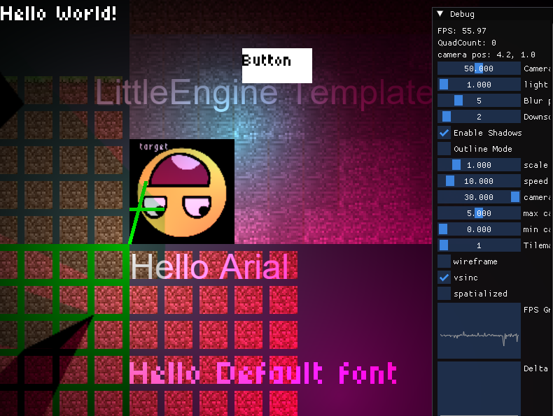
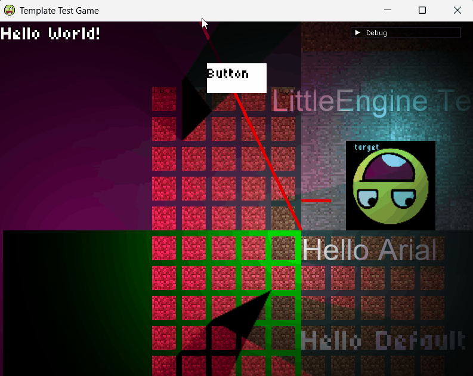
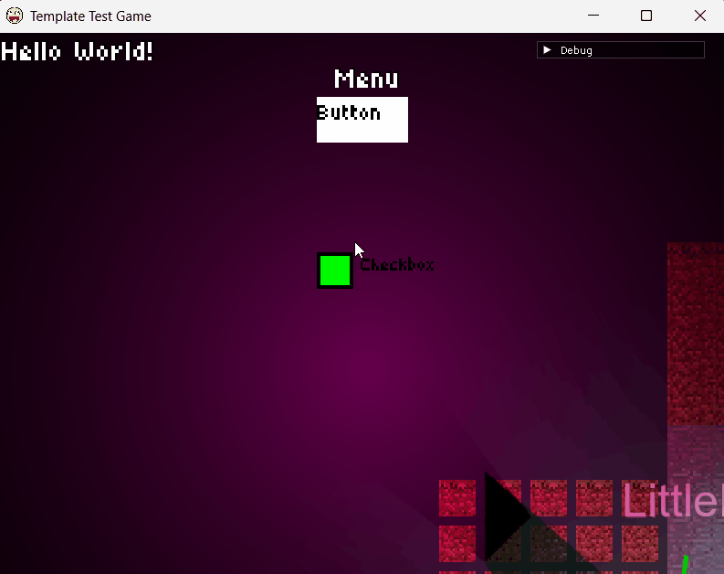

# LittleEngine Template




This repository is a **starter project** for building your own game using [LittleEngine](https://github.com/fyx0x/LittleEngine).  
It comes pre-configured with a working build system, entry point, and asset structure.

---

## 🚀 Quick Start

1. **Clone this repo** (or use it as a GitHub template):
   ```bash
   git clone https://github.com/fyx0x/LittleEngine-Template.git MyGame
   cd MyGame
   ```

2. **Initialize submodules** (if LittleEngine is included as a submodule):
   ```bash
   git submodule update --init --recursive
   ```

3. **Configure & build** (choose backend: `GLFW` or `SDL`):
   select a backend in the CMakeLists.txt : PLATFORM=GLFW or SDL
   set PRODUCTION_BUILD to ON if release build to disable ImGui and enable optimizations.
   ```bash
   cmake --build build -j
   ```

4. **Run the game executable**:
   ```bash
   ./build/MyGame
   ```

---

## 📂 Project Structure

```
assets/           # Your images, sounds, fonts, tilemaps
include/          # Game-specific headers
src/              # Game source files (main.cpp, game.cpp, etc.)
CMakeLists.txt    # Project build script (links against LittleEngine)
```

---

## ✨ What’s Included

- A working `main.cpp` that:
  - Initializes LittleEngine
  - Sets up the game loop
  - Renders sprites and text
  - Handles basic input
- CMake setup to build against the LittleEngine submodule
- `assets/` folder with example textures, fonts, and sounds
- Pre-configured platform backends (GLFW/SDL)

---

## 🖼️ Screenshots

Add screenshots or GIFs of your game/demo here! For example:




Screenshots are stored in `docs/` and referenced here.

---

## 🛠️ Customizing

- Rename the project in `CMakeLists.txt`:
  ```cmake
  project(MyGame)
  ```
- Replace the example assets with your own in `assets/`
- Add new source files under `src/` and include them in your game loop

---

## 📦 Using LittleEngine

This template links LittleEngine as a **submodule** by default.  
If you prefer to install LittleEngine system-wide and link it, adjust `CMakeLists.txt` accordingly.

For engine API docs, see the [LittleEngine README](https://github.com/fyx0x/LittleEngine).

---

## 📝 License

This template is released under the MIT License.  
LittleEngine and third-party dependencies retain their own licenses (see [LittleEngine/LICENSES.md](https://github.com/fyx0x/LittleEngine/blob/main/LICENSES.md)).
